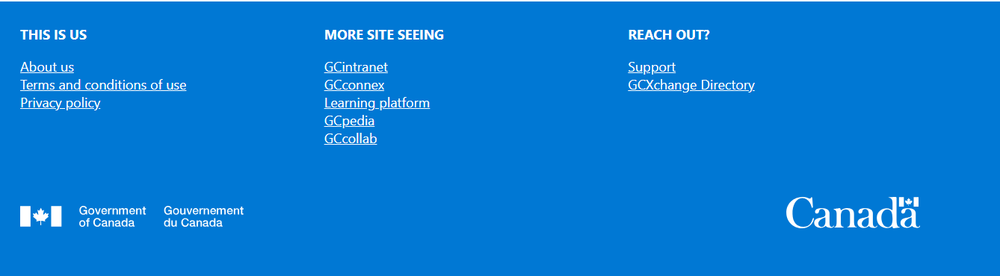

# footer-webpart

## Summary

React footer for GCX sharepoint. This footer contain hardcoded link for the government of canada, including the government of canada wordmark.

## Prerequisites

None

## API permission
None

## Version 

## Applies to

- [SharePoint Framework](https://aka.ms/spfx)
- [Microsoft 365 tenant](https://docs.microsoft.com/en-us/sharepoint/dev/spfx/set-up-your-developer-tenant)

> Get your own free development tenant by subscribing to [Microsoft 365 developer program](http://aka.ms/o365devprogram)

## Version history

Version|Date|Comments
-------|----|--------
1.0|Jun 22, 2021|Initial release
1.0.1  | Aug 25, 2023 | Upgraded to SPFX 1.17.4
2.0    | Sep 11, 2025 | Upgraded to SPFX 1.21.1

## Minimal Path to Awesome

- Clone this repository
- Ensure that you are at the solution folder
- Ensure the current version of the Node.js (16.3+)
- In the command-line run:
  - **npm install**
  - **gulp clean**
  - **gulp serve**
- To debug in the front end:
  - go to the `serve.json` file and update `initialPage` to `https://domain-name.sharepoint.com/_layouts/15/workbench.aspx`
  - Run the command **gulp serve**
- To deploy: in the command-line run
  - **gulp clean**
  - **gulp bundle --ship**
  - **gulp package-solution --ship**
- Add the webpart to your tenant app store

## Disclaimer

**THIS CODE IS PROVIDED *AS IS* WITHOUT WARRANTY OF ANY KIND, EITHER EXPRESS OR IMPLIED, INCLUDING ANY IMPLIED WARRANTIES OF FITNESS FOR A PARTICULAR PURPOSE, MERCHANTABILITY, OR NON-INFRINGEMENT.**