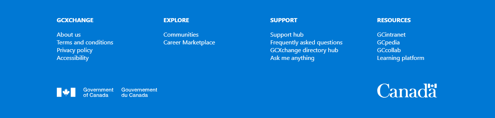

# footer-webpart

## Summary

React footer for GCX sharepoint. This footer contain hardcoded link for the government of canada, including the government of canada wordmark.

## Prerequisites

None

## API permission
None

## Version 

## Applies to

- [SharePoint Framework](https://aka.ms/spfx)
- [Microsoft 365 tenant](https://docs.microsoft.com/en-us/sharepoint/dev/spfx/set-up-your-developer-tenant)

> Get your own free development tenant by subscribing to [Microsoft 365 developer program](http://aka.ms/o365devprogram)

## Version history

Version|Date|Comments
-------|----|--------
1.0|Jun 22, 2021|Initial release
1.0.1  | Aug 25, 2023  | Upgraded to SPFX 1.17.4
2.0    | Sep 11, 2025  | Upgraded to SPFX 1.21.1
2.1    | June 17, 2026 | Upgraded to SPFX 1.22.2

## Minimal Path to Awesome
- Clone this repository
- Ensure that you are at the solution folder
- To install the dependencies, in the command-line run:
  - `npm install -g @rushstack/heft`
  - `npm install`
- To debug in the front end:
  - go to the `serve.json` file and update `initialPage` to `https://your-domain-name.sharepoint.com/_layouts/15/workbench.aspx`
  - In the command-line run:
    - `heft start`
    - You will need to add your client id and azure function to the clientId and url classs members in the SCW.tsx file.
- To deploy:
  - In the command-line run:
    - `heft build --production`
    - `heft package-solution --production`
  - Add the webpart to your tenant app store
- Approve the web API permissions
- Add the Webpart to a page
- Modify the property pane according to your requirements

## Disclaimer

**THIS CODE IS PROVIDED *AS IS* WITHOUT WARRANTY OF ANY KIND, EITHER EXPRESS OR IMPLIED, INCLUDING ANY IMPLIED WARRANTIES OF FITNESS FOR A PARTICULAR PURPOSE, MERCHANTABILITY, OR NON-INFRINGEMENT.**